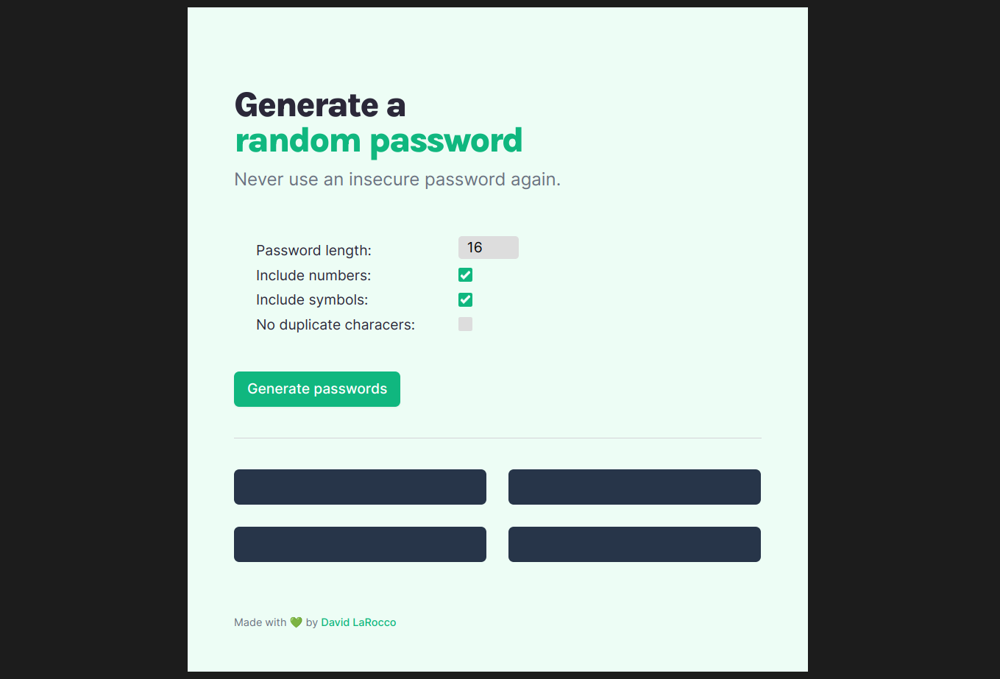

# Password Generator

Password Generator is a simple web app that creates secure passwords, allows the user to specify what characters to include in the passwords, and provides an easy copy-paste functionality. 

## Usage
Once deployed, the link will appear here!

If you want to run the app locally, download the files and point the browser to the `index.html` file on your local machine.  No installation is required.

## Project Purpose and Goals
This is a solo project from [Scrimba's](https://scrimba.com) Frontend Career Path program.  It was a great review of the basics, and I had fun with the stretch goals: basically all of the password options and the copy-paste functionality.  I didn't change the styles Scrimba provided very much, as I liked them (I did learn how annoying it is to customize input checkboxes tho 😖), but I wanted to practice using Sass and refine UI elements.

## Acknowledgments 
Thanks to [Scrimba](https://scrimba.com) for creating such a great program, and providing Figma files for these solo projects.

## Resources
* [How to copy to the clipboard using JavaScript](https://flaviocopes.com/clipboard-api/)
* [How To Make a Modal Box With CSS and JavaScript
](https://www.w3schools.com/howto/howto_css_modals.asp)
* [Styling HTML Checkboxes Is Super Easy](https://dev.to/proticm/styling-html-checkboxes-is-super-easy-302o) (_not what I actually used, but makes more sense_)
* [How to Create a Dark Mode with SASS/SCSS and Vanilla JavaScript](https://medium.com/p/e1c7835cf474)